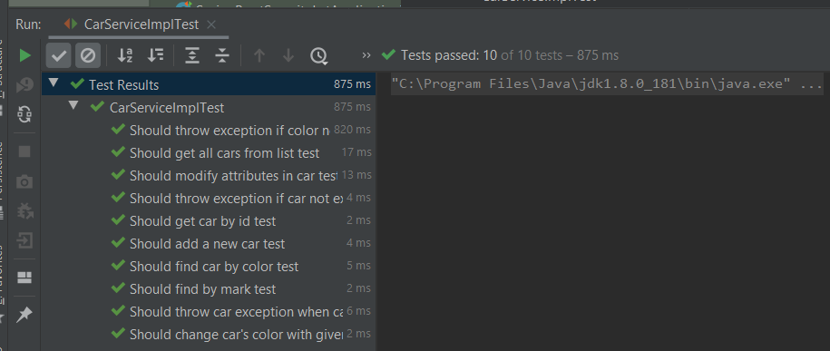
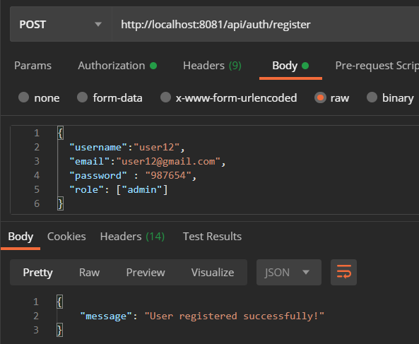
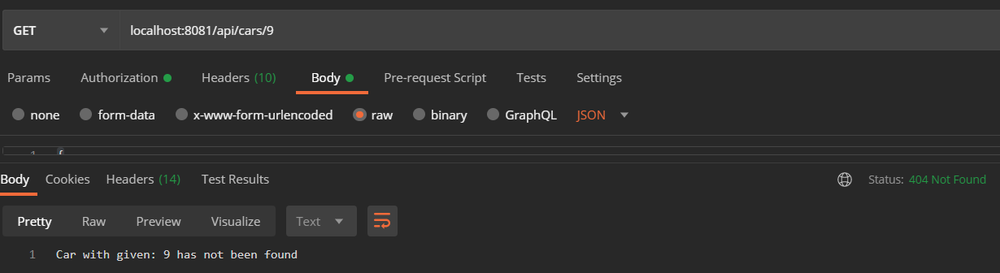
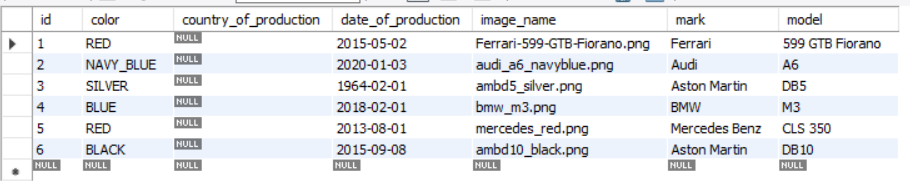
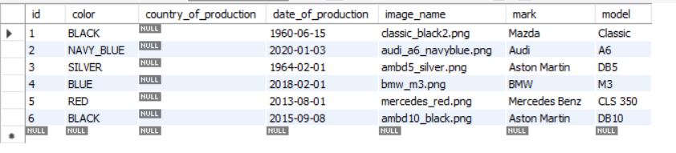

"Design car" prototype application.
This part application is connected with frontend part: https://github.com/Iwona007/design-car-angular
Please go to above http address to be able to read about used technology in frontend. There also are information 
how to use this application in Angular. 

Please be aware that localhost from Tomcat port: 8080 has been directed to port number: 8081. 

Application has been deployed on heroku: https://design-your-car-backend.herokuapp.com/

This application hs been created in order to enjoy in design car. User can play with different attributes such as:
Mark, model, color, image and date of production. It is recommended to mix this elements e.g: user can edit
car with id number 1 and change mark, model, color, image and date for these value which he/she would like to receive.
In other words they can create Aston Martin G3  with image like Royce Rolls in classic version  with color: Navy blue
and date of production 1989. And as a result user is able to receive his/her car prototype. 

This part description show only how to use this application in Java and Spring Boot without frontend part. 
At fest if we go to endpoint /api/cars all user are able to see all cars list even if user is not logged in or 
registered. 

Secondly this application has two user already in database: an "Admin" and a "User" with different permission.
For instance user with user role has smaller privilege than admin role however these permissions are the same as admin's.
In this application user is allowed to: 
get car by id => endpoints: /api/cars/{id},
get cars by color => endpoints: /api/cars/color/{color} , 
get cars by mark => endpoints: /api/cars/mark/{mark}, 
edit car which has been found by id => endpoints: /api/cars/edit/{id} and 
update only color in car which has been found by id => endpoints /api/cars/color/{id}/{color}.
Endpoints for those action are in CarController.class. Please feel free to go there.

Thirdly admin role has wider privilege than user and additionally admin role car: 
add car => endpoints: /api/cars/add and 
delete car which has been found by id => endpoints: /api/cars/delete/{id} .
Endpoints for those action are also in CarController.class to where I invite you. 

Additionally, some methods such as: getById, removeById, findByColor throw exception when database doesn't have 
requested resources. In case of method above these resources can be id number which not exist in database or color which 
has not been add in Color.class. 

Images from tests which I executed are in src/main/resources/img. Below the technology stack I attached only a couple 
of them. 

Used technology and libraries:
Java 1.8
Spring Boot 2.3.3
Spring Security
Json Web Token
Lombok
JPA & Hibernate
MySql 8 -> heroku: JawsDb MySql
Postman
AOP used for exception

Library used in tests:
Mockito
Junit5
Hamcrest

images test

images test from Postman:
registered admin role successfully:

logged user role:

exception for method getById:

images from database:
cars table:

after registered a new user2:

after edited car by editCar method:

