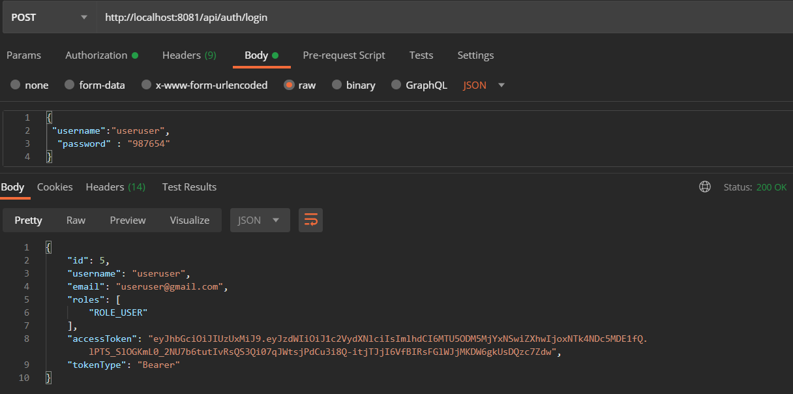

"Design car" prototype application. 
This part of the application is connected with the frontend: https://github.com/Iwona007/design-car-angular 
Please go to the above http address to be able to read about what technology was used in the frontend. There 
is also information on how to use this application in Angular.

Please be aware that localhost from Tomcat port: 8080 has been directed to port number: 8081.

<!-- Application has been deployed on heroku: https://design-car-angular.herokuapp.com/home -->
This application has been created in order to enjoy designing car. Users can play with different attributes 
such as: mark, model, color, image and date of production. It is recommended to mix these elements e.g: users 
can edit the car with id number 1 and change mark, model, color, image and date for these values which he/she 
would like to receive. In other words, they can create an Aston Martin G3 with the appearance of a classic, 
navy-blue Rolls Royce and date of production 1989. And as a result users are able to receive his/her car prototype.
This part of the description shows only how to use this application in Java and Spring Boot without the frontend. 
At first, if we go to endpoint /api/cars all users are able to see the entire car list even if the user is not logged 
in or registered.

Secondly this application already has two users in the database: an "Admin" and a "User" with different permission. 
For instance, users with the user role have fewer privileges than admin role. 
In this application users are allowed to: 
get car by id => endpoint: /api/cars/{id}, 
get cars by color => endpoint: /api/cars/color/{color}, 
get cars by mark => endpoint: /api/cars/mark/{mark}, 
edit car which has been found by id => endpoint: /api/cars/edit/{id} and 
update only color in car which has been found by id => endpoint /api/cars/color/{id}/{color}. 
Endpoints for these actions are in CarController.class. Please feel free to go there.

Thirdly, the admin role has wider privileges than the user and additionally admin role car: 
add car => endpoints: /api/cars/add and 
delete car which has been found by id => endpoints: /api/cars/delete/{id}. 
Endpoint for this action is also in CarController.class - to where I invite you.

Additionally, some methods such as: getById, removeById, findByColor throw an exception when the database doesn't 
have requested resources. These resources can be id number which does not exist or color which has not been added 
to Color.class.

Images from tests which I executed are stored in src/main/resources/img. Below I have attached only a couple of them.

Used technology and libraries: 
Java 1.8 
Spring Boot 2.3.3 
Spring Security 
son Web Token 
Lombok 
JPA & Hibernate 
MySql 8 -> heroku: JawsDb MySql 
Postman 
AOP used for exception

Library used in tests:
Mockito
Junit5
Hamcrest

images test

images test from Postman:
registered admin role successfully:

logged user role:

exception for method getById:

images from database:
cars table:

after registered a new user2:

after edited car by editCar method:

